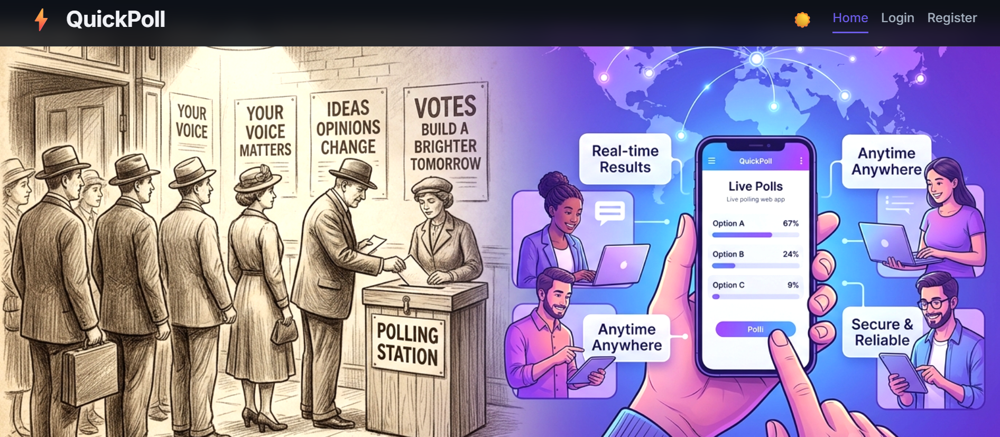
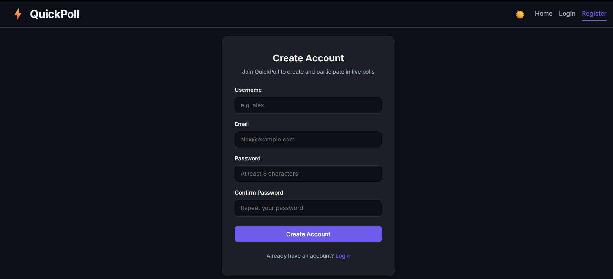
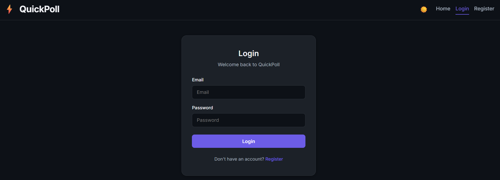
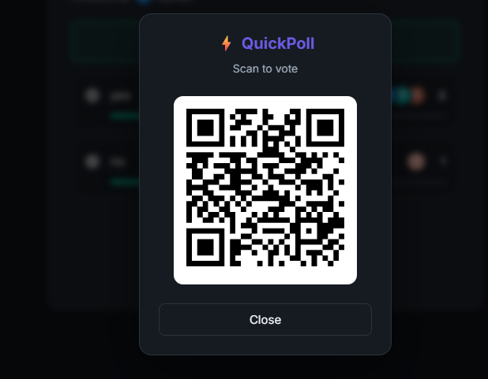

# QuickPoll — Real-Time Polling Tool

## 1. Project Overview
QuickPoll is a full-stack, real-time web application that enables users to create custom polls, share them via direct link or QR code, cast authenticated votes, and observe live vote count updates instantaneously without page refreshes.

The project is built specifically to demonstrate clean separation of concerns, persistent data storage with MongoDB, atomic real-time counters and Pub/Sub event broadcasting using Redis, and WebSocket-driven client updates.

---

## 2. Features
- **User Authentication**: Secure JWT-based registration and login using bcrypt password hashing.
- **Poll Creation**: Authenticated users can create polls with custom questions and 2+ options.
- **Real-Time Live Voting**: Instant vote updates across all connected clients watching the poll via WebSockets & Redis Pub/Sub.
- **Duplicate Vote Protection**: Strictly enforces one vote per user per poll backed by a MongoDB compound index.
- **Voter Avatars & Names**: Displays voter initials and usernames next to option vote counts with custom color palettes.
- **Poll Management**: Creators can manage and delete their own polls from their Dashboard (with strict creator-only authorization checks).
- **Interactive Analytics**: Detailed creator analytics page featuring an SVG Doughnut Vote Distribution chart and progress bar breakdown.
- **QR Code Sharing**: Generates shareable QR codes that encode the public application URL for scanning on mobile devices.
- **Copy Link**: One-click sharing that copies the poll URL using environment-aware domain resolution.

---

## 3. Tech Stack

### Frontend
- **Framework**: React 19 (Vite build tool)
- **Routing**: React Router v7
- **Styling**: Vanilla CSS with custom properties & glassmorphism dark/light theme
- **QR Code Generation**: `qrcode.react`

### Backend
- **Language**: Go 1.22+
- **Web Framework**: Gin Gonic
- **WebSocket Engine**: Gorilla WebSocket

### Database & Cache
- **Primary Database**: MongoDB (Persistent storage for Users, Polls, and Votes)
- **Real-Time Cache & Pub/Sub**: Redis (Atomic vote counters via `INCR`, event broadcasting via Pub/Sub)

---

## 4. Project Structure
```text
QuickPoll/
├── frontend/       # React 19 + Vite frontend application
│   ├── src/
│   │   ├── components/
│   │   ├── context/
│   │   ├── pages/
│   │   ├── utils/
│   │   ├── App.jsx
│   │   └── main.jsx
│   ├── .env.example
│   └── package.json
├── backend/        # Go + Gin REST API & WebSocket server
│   ├── database/
│   ├── handlers/
│   ├── middleware/
│   ├── models/
│   ├── websocket/
│   ├── .env.example
│   ├── go.mod
│   └── main.go
├── README.md
└── .gitignore
```

---

## 5. How QuickPoll Works
1. **User Registers/Logs In**: Receives a JWT containing `user_id` and `username`.
2. **User Creates a Poll**: Saved to MongoDB `polls` collection.
3. **Link/QR Code Sharing**: Shared via `VITE_APP_URL/poll/:id` or QR Code modal.
4. **Audience Votes**: Authenticated users cast a vote. The backend records the vote in MongoDB `votes` and `polls` collections, increments the Redis option counter, and publishes a vote event to Redis Pub/Sub.
5. **Real-Time Update**: The WebSocket hub receives the Redis Pub/Sub message and broadcasts it to all clients watching that poll, updating the vote counts and avatars live.

---

## 6. Realtime Voting Flow

```text
React Client (Cast Vote)
    ↓
Go / Gin API (/api/polls/:id/vote)
    ↓
Validation & Duplicate Check
    ↓
MongoDB Persistence (votes & polls collections)
    ↓
Redis INCR (poll:{id}:votes:{optID})
    ↓
Redis PUBLISH ("poll_votes" channel)
    ↓
Go WebSocket Hub (subscribes to "poll_votes")
    ↓
WebSocket Broadcast (to all clients watching poll_id)
    ↓
React State Update (UI updates live without refresh)
```

---

## 7. Authentication
- **Token Format**: JSON Web Token (JWT) signed with `JWT_SECRET`.
- **Claims**: `user_id`, `username`, `exp` (72-hour validity).
- **Password Hashing**: Passwords stored using `bcrypt.GenerateFromPassword`.
- **Middleware**: `AuthRequired()` extracts the `Authorization: Bearer <token>` header, verifies the token, and attaches `userID` and `username` to the Gin context.

---

## 8. API Endpoints

### Public Endpoints
- `GET /` — Health check endpoint.
- `POST /api/auth/register` — Register a new user account.
- `POST /api/auth/login` — Authenticate user and receive a JWT token.
- `GET /api/polls` — List all public polls.
- `GET /api/polls/:id` — Get poll details, options, vote counts, and voters.
- `GET /api/ws/polls/:id` — Establish WebSocket connection for real-time poll updates.

### Protected Endpoints (Requires `Authorization: Bearer <token>`)
- `POST /api/polls` — Create a new poll with question and options.
- `GET /api/user/polls` — List polls created by the authenticated user.
- `POST /api/polls/:id/vote` — Cast a vote on a poll option.
- `GET /api/polls/:id/voted` — Check if the authenticated user has already voted in a poll.
- `DELETE /api/polls/:id` — Delete a poll (creator-only check).

---

## 9. Environment Variables

### Backend (`backend/.env`)
```env
MONGODB_URI=your_mongodb_connection_string
DB_NAME=your_database_name
REDIS_URL=your_redis_connection_string
JWT_SECRET=your_strong_jwt_secret
PORT=8080
```

### Frontend (`frontend/.env`)
```env
VITE_API_URL=http://localhost:8080
VITE_APP_URL=http://localhost:5173
```

---

## 10. Running the Project Locally

### Prerequisites
- Go 1.22+
- Node.js 18+ and npm
- Running MongoDB instance (or MongoDB Atlas connection)
- Running Redis instance (or Redis Cloud connection)

### 1. Backend Setup
```bash
cd backend
cp .env.example .env
# Fill in MONGODB_URI, REDIS_URL, and JWT_SECRET in .env
go run .
```
*Backend server will start at `http://localhost:8080`.*

### 2. Frontend Setup
```bash
cd frontend
cp .env.example .env
npm install
npm run dev
```
*Frontend app will start at `http://localhost:5173`.*

---

## 11. Analytics
The Analytics page (`/analytics/:id`) is accessible exclusively to the poll creator and provides:
- **Total Votes & Leading Option KPI Cards**: High-level poll performance overview.
- **Vote Distribution Chart**: Responsive SVG Doughnut Chart illustrating option proportions with custom color coding.
- **Zero-Vote State Handling**: Displays a clean empty state ring if no votes have been recorded.
- **Live Updates**: Connects to the poll's WebSocket feed so analytics reflect new votes in real-time.

---

## 12. QR Code Sharing
- Generated on the Poll detail page using `qrcode.react` (`QRCodeSVG`).
- Encodes the environment-configured frontend base URL (`VITE_APP_URL/poll/:id`).
- When scanned from mobile devices, redirects directly to the public live poll page.

---

## 13. Key Technical Decisions
- **Redis + WebSockets**: Using Redis Pub/Sub to back the WebSocket hub enables horizontal scaling across multiple backend application instances.
- **Dual Storage Strategy**: MongoDB handles persistent relational audit trails, while Redis maintains fast in-memory counters andPub/Sub event streams.
- **Shared Public URL Generator**: Unified URL helper (`getPollUrl`) guarantees that QR Code generation and Copy Link functionality produce identical URLs across all components.

---

## 14. Security Considerations
- Password hashes generated with `bcrypt` default cost (10).
- Passwords are never returned in JSON response payloads.
- Poll deletion strictly validates `poll.CreatorID == authenticated_user_id` (returns HTTP 403 Forbidden on mismatch).
- Input sanitization for email addresses and usernames.
- Environment variables (`.env`) ignored in `.gitignore` to prevent credential leakage.

---

## 📸 Screenshots

### Home Page


### Register


### Login


### Dashboard


### Create Poll


### Live Poll


### Analytics


### QR Code Sharing


---

## 16. Build Verification
To verify production readiness:

```bash
# Verify Backend
cd backend
gofmt -w .
go test ./...
go build ./...

# Verify Frontend
cd frontend
npm run build
```

---

## 17. Deployment

### Backend Deployment (e.g., Railway / Render / Heroku)
1. Deploy the `/backend` directory.
2. Set environment variables: `MONGODB_URI`, `REDIS_URL`, `JWT_SECRET`, `PORT`.

### Frontend Deployment (e.g., Vercel / Netlify)
1. Deploy the `/frontend` directory.
2. Set environment variables:
   - `VITE_API_URL=https://<your-backend-domain>`
   - `VITE_APP_URL=https://<your-frontend-domain>`

---

## 18. Future Enhancements
- Poll expiration dates and automatic voting closure.
- Exporting analytics reports to CSV/PDF.
- Multi-choice voting options.

---

## 19. Author

**Vanitha N**  
*B.E. Computer Science and Engineering*
