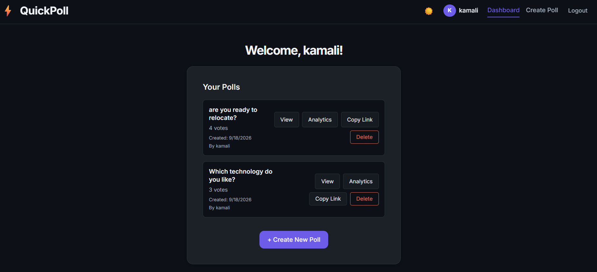
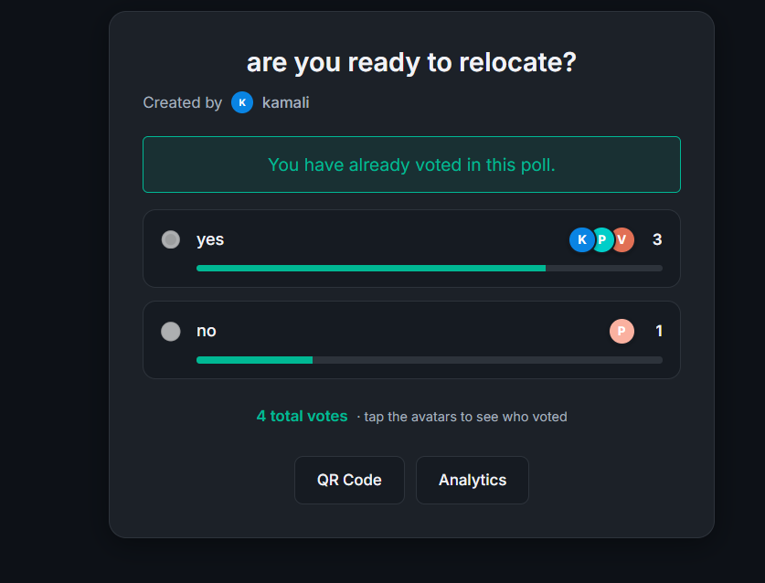
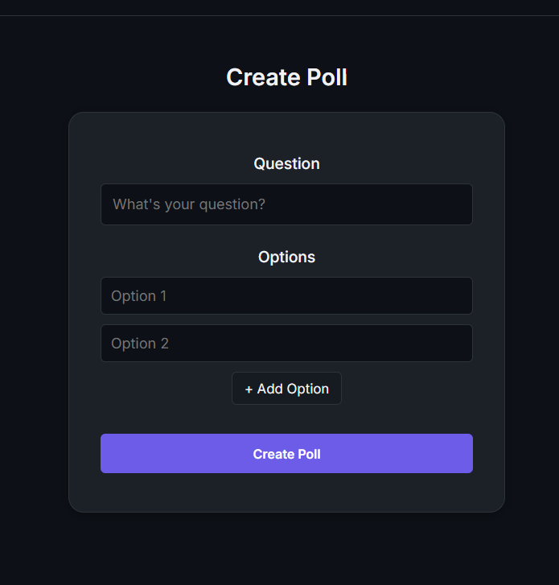
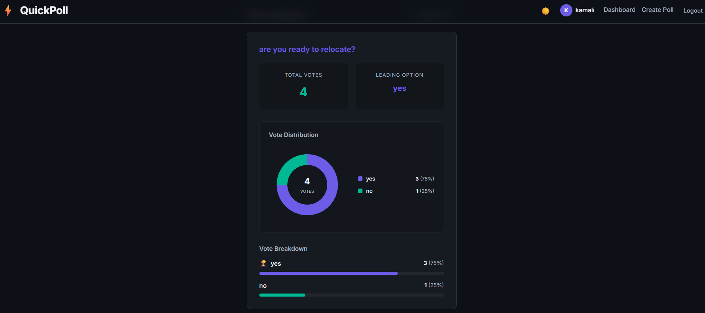

# QuickPoll — Enterprise Real-Time Live Polling Platform

[](https://github.com/VANITHA1011/QuickPoll/actions/workflows/ci.yml)
[](https://quick-poll-chi.vercel.app?utm_source=chatgpt.com)
[](https://go.dev/)
[](https://react.dev/)
[](https://www.mongodb.com/)
[](https://redis.io/)

**Live Application URL**: [https://quick-poll-chi.vercel.app?utm_source=chatgpt.com](https://quick-poll-chi.vercel.app?utm_source=chatgpt.com)

---

## 1. Executive Summary
**QuickPoll** is a production-grade, distributed real-time polling and audience engagement platform. Engineered for sub-second responsiveness, QuickPoll couples a Go (Gin) API and Gorilla WebSocket engine with a high-performance React 19 single-page application. 

The system leverages **MongoDB Atlas** for acid-compliant, persistent relational data storage (users, polls, votes) and **Redis** for distributed atomic in-memory counting and Pub/Sub event broadcasting. Real-time vote updates, activity feeds, and audience changes propagate immediately to all connected browsers without page reloads.

---

## 2. Key Architecture & Highlights

```text
               ┌────────────────────────────────────────────────────────┐
               │              React 19 + Vite Frontend                  │
               │  (Live Countdown, Avatars, Dynamic Charts, QR Codes)   │
               └───────────────▲────────────────────────▲───────────────┘
                               │ HTTP REST API          │ WebSockets (WSS)
                               ▼                        ▼
               ┌────────────────────────────────────────────────────────┐
               │               Go + Gin Backend Server                  │
               │   (JWT Auth, Rate Limiting, Middleware, WebSocket Hub) │
               └───────────────▲────────────────────────▲───────────────┘
                               │                        │
             Writes & Queries  │                        │ Atomic INCR & Pub/Sub
                               ▼                        ▼
                   ┌───────────────────────┐   ┌───────────────────────┐
                   │     MongoDB Atlas     │   │     Upstash Redis     │
                   │ (Users, Polls, Votes) │   │ (Pub/Sub & Counters)  │
                   └───────────────────────┘   └───────────────────────┘
```

### Real-Time Distributed Flow
1. **Vote Ingestion**: When a voter clicks an option, an authenticated `POST /api/polls/:id/vote` request arrives at the Go backend.
2. **Atomic Validation**: The backend validates poll status, dynamic expiration timestamps, and MongoDB compound unique index `(poll_id, user_id)` to strictly prevent duplicate votes.
3. **Data Mutation**: The poll option vote count increments in MongoDB, and the vote audit record is committed.
4. **Redis Pub/Sub Broadcast**: An atomic `INCR` executes on Redis (`poll:{id}:votes:{optID}`) followed by a `PUBLISH` event on the `poll_votes` channel.
5. **WebSocket Multicast**: Across all backend worker nodes, subscribed WebSocket hubs receive the event and multicast it to every client socket subscribed to that `poll_id`.
6. **Optimistic React Rerender**: The frontend dynamically calculates percentages, triggers smooth CSS bar transitions, updates voter avatar rings, and displays live ticker activity.

---

## 3. Core Enterprise Features

### ⏱️ Dynamic Poll Lifecycle & Expiration
- **Time-bound Voting**: Creators can configure poll expiration (1 hour, 24 hours, 3 days, 7 days, or unlimited).
- **Live Countdown Timer**: Voters see an active countdown ticker (`⏱️ 2h 45m 12s remaining`).
- **Automated Cutoff**: Once expired, the backend dynamically switches poll status to `CLOSED` and strictly blocks new votes with friendly error messaging.

### 📊 SaaS Analytics & KPI Dashboard
- **Executive Metrics**: Total Polls Created, Active Live Polls, Cumulative Votes Received, and Average Engagement Rate.
- **Audience Exploration**: Instant client-side search, status filters (`All` / `Live` / `Closed`), and multi-attribute sorting (`Newest`, `Oldest`, `Most Votes`).
- **Interactive Visualizations**: SVG Donut Distribution charts with hover states and custom color palettes.
- **Export Summary**: One-click clipboard export of poll statistics formatted for team messaging (Slack, Discord, Email).

### 🎨 Design System & Visual Excellence
- Built with a custom, high-contrast design system supporting both dark and light modes.
- **Pulsing Status Badges**: Animated glowing green indicators for live active sessions.
- **Two-Column Creation Studio**: Form controls with live audience preview on the right that renders in real time as options are added.
- **Voter Avatar Stacks**: Shows user initials and avatars with modal click-through to inspect voter identity.
- **Unified Sharing**: Modal bundling direct link copy with immediate visual feedback and SVG QR Code generation for instant mobile scanning.

---

## 4. Technology Stack

| Layer | Technologies |
|---|---|
| **Frontend UI** | React 19, Vite, React Router v7, `qrcode.react` |
| **Styling** | Vanilla CSS Design Tokens, Glassmorphism, CSS Transitions |
| **Backend Engine** | Go 1.24, Gin Web Framework, Gorilla WebSocket |
| **Security** | JWT (HMAC-SHA256), `bcrypt` password hashing, CORS Middleware |
| **Primary Database** | MongoDB v6+ (MongoDB Atlas Driver v2) |
| **Cache & Realtime** | Redis / Upstash Redis (Pub/Sub & In-Memory Counters) |
| **CI / CD** | GitHub Actions, Vercel, Render |

---

## 5. API Reference

### Public Endpoints
| Method | Endpoint | Description |
|---|---|---|
| `GET` | `/` | Health check returning service status, uptime, and database states |
| `POST` | `/api/auth/register` | Register new user account with bcrypt password hashing |
| `POST` | `/api/auth/login` | Authenticate credentials and receive a JWT token |
| `GET` | `/api/polls` | List public polls |
| `GET` | `/api/polls/:id` | Retrieve poll details, dynamic status, and option breakdown |
| `GET` | `/api/ws/polls/:id` | Upgrade connection to WebSocket stream for live updates |

### Protected Endpoints (Requires `Authorization: Bearer <token>`)
| Method | Endpoint | Description |
|---|---|---|
| `POST` | `/api/polls` | Create new poll with expiration rules and options (2–10) |
| `GET` | `/api/user/polls` | Fetch creator-specific polls for dashboard KPIs |
| `POST` | `/api/polls/:id/vote` | Cast an authenticated vote on a poll option |
| `GET` | `/api/polls/:id/voted` | Inspect whether current user has voted on the poll |
| `DELETE` | `/api/polls/:id` | Permanently delete a poll (Creator-only verification) |

---

## 6. Environment Variables

### Backend (`backend/.env`)
```env
PORT=8080
MONGODB_URI=mongodb+srv://<user>:<pass>@cluster.mongodb.net/?retryWrites=true&w=majority
DB_NAME=quickpoll
REDIS_URL=rediss://default:<pass>@<host>:<port>
JWT_SECRET=your_super_secret_jwt_key_here
```

### Frontend (`frontend/.env`)
```env
VITE_API_URL=http://localhost:8080
VITE_APP_URL=http://localhost:5173
```

---

## 7. Local Development & Setup

### Prerequisites
- [Go 1.22+](https://go.dev/dl/)
- [Node.js 18+](https://nodejs.org/) & npm
- MongoDB Atlas account (or local MongoDB)
- Upstash Redis account (or local Redis)

### 1. Clone Repository
```bash
git clone https://github.com/VANITHA1011/QuickPoll.git
cd QuickPoll
```

### 2. Configure & Run Backend
```bash
cd backend
cp .env.example .env
# Configure your MONGODB_URI, REDIS_URL, and JWT_SECRET
go run .
```
Backend initializes at `http://localhost:8080`.

### 3. Configure & Run Frontend
```bash
cd ../frontend
cp .env.example .env
npm install
npm run dev
```
Frontend serves at `http://localhost:5173`.

---

## 8. Verification & Automated Testing

### Backend Unit Tests
Execute the Go test suite covering JWT authentication middleware, expiration logic, and WebSocket serialization:
```bash
cd backend
go test -v ./middleware ./models ./websocket
```

### Frontend Production Build
Compile production bundles and ensure zero lint or TypeScript/JSX issues:
```bash
cd frontend
npm run build
```

### Continuous Integration (CI)
GitHub Actions automatically runs backend unit tests, Go binary builds, and Vite frontend builds on every pull request and push to `main` via `.github/workflows/ci.yml`.

---

## 9. Screenshots

| SaaS Dashboard | Live Poll & Countdown |
|---|---|
|  |  |

| Create Studio with Preview | Realtime Analytics |
|---|---|
|  |  |

---

## 10. Author & Evaluation
**Vanitha N**  
*B.E. Computer Science and Engineering*  
GitHub: [@VANITHA1011](https://github.com/VANITHA1011)  
Production App: [https://quick-poll-chi.vercel.app?utm_source=chatgpt.com](https://quick-poll-chi.vercel.app?utm_source=chatgpt.com)
